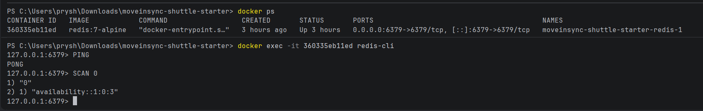

# MoveInSync Shuttle Booking — Case Study Evidence

> Screenshots are stored in the `screenshots/` folder.  
> When this Markdown file is opened from the project root, the images below will render automatically.

---

## 1. User Registration

### API

```http
POST /api/auth/register
```

### Screenshot


**Demonstrates:** public registration, request validation, user creation, and the `REGISTERED` response.

> **Security note:** The submitted screenshot should ideally hide/blur the password value.

---

## 2. Authentication / Unauthorized Access

### Screenshot


**Demonstrates:** protected API access returns `401 Unauthorized` when authentication is not supplied.

---

## 3. Route Creation

### API

```http
POST /api/routes
```

### Screenshot


**Demonstrates:** creation of an ordered shuttle route with stops.

---

## 4. Trip Creation

### API

```http
POST /api/trips
```

### Screenshot


**Demonstrates:** creation of a trip for a route with a configured seat capacity.

---

## 5. Initial Seat Availability

### API

```http
GET /api/trips/1/availability?fromOrder=0&toOrder=3
```

### Screenshot


**Demonstrates:** availability calculation before bookings are made.

---

## 6. Successful Booking

### API

```http
POST /api/trips/1/bookings
```

### Screenshot


**Demonstrates:** successful booking and `CONFIRMED` status with a seat allocation.

---

## 7. Overlapping Segment Booking

### First booking

```text
User 1: A → C
```

### Second booking

```text
User 2: B → D
```

These segments overlap between `B` and `C`, so the two bookings cannot use the same seat.

### Screenshot


**Demonstrates:** a second overlapping booking is accepted only with another available seat.

### Core rule

The system uses half-open intervals:

```text
[fromOrder, toOrder)
```

Therefore:

```text
A → C = [0, 2)
B → D = [1, 3)
```

These intervals overlap.

---

## 8. Availability After Booking

### API

```http
GET /api/trips/1/availability?fromOrder=1&toOrder=3
```

### Screenshot


**Demonstrates:** availability changes according to confirmed overlapping bookings.

---

## 9. Additional Booking / Segment Demonstration

### Screenshot


Use this screenshot as supporting evidence for the segment-based booking flow.

For the final submission, the most useful accompanying explanation is:

> The booking service checks confirmed bookings whose segments overlap the requested interval before allocating a seat.

---

## 10. One-Seat Trip Booking

### Screenshot


**Demonstrates:** booking against the one-seat trip used for the waitlist scenario.

---

## 11. Waitlist

### API

```http
POST /api/trips/2/waitlist
```

### Screenshot


**Demonstrates:** when no suitable seat is available, the user can be added to the waitlist with `WAITLISTED` status.

---

# 12. Cancellation → Waitlist Promotion

### Screenshot to add

> Add a screenshot here after cancelling the confirmed booking and verifying that the first eligible waitlisted user has been promoted.

**Expected flow:**

```text
User 1
CONFIRMED
Seat 1
   |
   | cancel
   v
Seat becomes available
   |
   v
User 2
WAITLISTED
   |
   v
PROMOTED
   |
   v
CONFIRMED
Seat 1
```

Suggested filename:

```text
screenshots/Screenshot-cancellation-promotion.png
```

---

# 13. Error Handling

The final submission should show these three cases.

### 401 — Unauthorized

Already captured:


### 400 — Invalid Segment

> Add a screenshot of an invalid request such as:

```text
fromOrder >= toOrder
```

Expected:

```text
400 Bad Request
```

Suggested filename:

### 409 — Booking Conflict

> Add a screenshot showing an overlapping booking when no suitable seat remains.

Expected:

```text
409 Conflict
```

Suggested filename:

```text
screenshots/Screenshot-409-no-seat.png
```

---

# 14. Automated Test Results

```text
screenshots/Screenshot-
```

After the final implementation is complete, run:

```bash
mvn clean test
```

Add the screenshot showing:

```text
Tests run: ...
Failures: 0
Errors: 0
Skipped: 0

BUILD SUCCESS
```

Suggested filename:

```text
screenshots/Screenshot-tests-success.png
```

### Tests covered

- Segment seat reuse
- Overlapping segment allocation
- Availability calculation
- Invalid segment validation
- No-show and waitlist promotion
- Cancellation and waitlist promotion
- FIFO waitlist behavior
- Concurrent last-seat booking
- Authentication/security behavior

---

# 15. Database State

### Screenshot to add

Add a screenshot from Neon/PostgreSQL showing relevant tables/data:

```text
users
routes
stops
trips
bookings
waitlist_entries
```

Suggested filename:

```text
users
```

```text
bookings
```

```text
routes
```

```text
stops
```

```text
trips
```
---

# 16. Redis Cache

### Optional screenshot

If available, add a Redis screenshot showing an availability cache entry.

Suggested filename:
```text
screenshots/Screenshot-redis.png
```

Redis is used for availability caching while PostgreSQL remains the source of truth for booking state.

---

# 17. Core Technical Decisions

## Segment overlap

The system uses half-open intervals:

```text
[fromOrder, toOrder)
```

Two bookings overlap when:

```text
existing.from < requested.to
AND
existing.to > requested.from
```

Therefore:

```text
A → B
B → D
```

can reuse a seat because:

```text
[0,1)
[1,3)
```

do not overlap.

But:

```text
A → C
B → D
```

cannot share a seat because:

```text
[0,2)
[1,3)
```

overlap.

---

## Concurrency control

Booking uses a transaction and pessimistic locking on the trip.

```text
Request A                    Request B
    |                            |
    v                            v
Lock Trip                    Wait
    |
Check seats
    |
Allocate seat
    |
Save booking
    |
Commit
    |
Unlock
                                 |
                                 v
                           Acquire lock
                                 |
                           Check seats
                                 |
                           Seat occupied
                                 |
                                 v
                              409
```

This prevents two concurrent requests from both claiming the same last available seat.

---

## Cache invalidation

Availability is cached in Redis.

When a booking changes availability:

```text
Booking / Cancellation / No-show
             |
             v
     Availability changed
             |
             v
      Invalidate cache
```

PostgreSQL remains authoritative.

---

# 18. End-to-End Demo Flow

Execute the APIs in this order:

```text
1. Register User
       ↓
2. Create Route
       ↓
3. Create Trip
       ↓
4. Check Availability
       ↓
5. Book Seat
       ↓
6. Book Overlapping Segment
       ↓
7. Check Availability Again
       ↓
8. Create One-Seat Trip
       ↓
9. Fill the Seat
       ↓
10. Add User to Waitlist
       ↓
11. Cancel / Mark No-show
       ↓
12. Verify Waitlist Promotion
       ↓
13. Demonstrate 401 / 400 / 409
       ↓
14. Run Maven Tests
       ↓
15. Show Database State
```

---

# 19. Recommended Final Screenshot Set

For the final submission, prioritize these:

| # | Evidence | Current screenshot |
|---|---|---|
| 1 | Registration | `Screenshot (1236).png` |
| 2 | Unauthorized access | `Screenshot (1235).png` |
| 3 | Route creation | `Screenshot (1237).png` |
| 4 | Trip creation | `Screenshot (1238).png` |
| 5 | Initial availability | `Screenshot (1239).png` |
| 6 | Successful booking | `Screenshot (1240).png` |
| 7 | Overlapping booking | `Screenshot (1241).png` |
| 8 | Availability after booking | `Screenshot (1242).png` |
| 9 | Waitlist | `Screenshot (1245).png` |
| 10 | Tests | **Add after final `mvn clean test`** |
| 11 | Database | **Add Neon/PostgreSQL screenshot** |
| 12 | Cancellation/promotion | **Add after cancellation demo** |

You do **not** need to submit every available screenshot. The goal is to show the important business flows clearly.

---

# 20. Final Submission Checklist

- [x] Registration screenshot
- [x] Unauthorized `401` screenshot
- [x] Route creation screenshot
- [x] Trip creation screenshot
- [x] Availability screenshot
- [x] Successful booking screenshot
- [x] Overlapping segment screenshot
- [x] Post-booking availability screenshot
- [x] Waitlist screenshot
- [x] Cancellation → waitlist promotion screenshot
- [x] `400 Bad Request` screenshot
- [x] `409 Conflict` screenshot
- [x] Final Maven `BUILD SUCCESS` screenshot
- [x] PostgreSQL/Neon screenshot
- [x] Redis screenshot *(optional)*
- [x] Verify no passwords/secrets are visible
- [x] Commit the `screenshots/` folder and Markdown file
- [x] Final `git status` is clean
